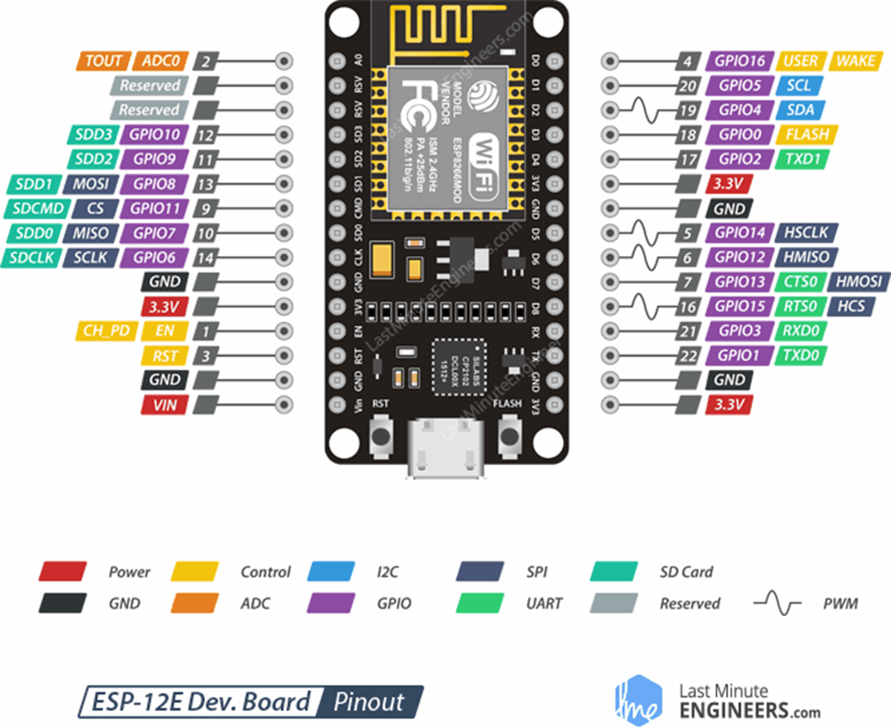
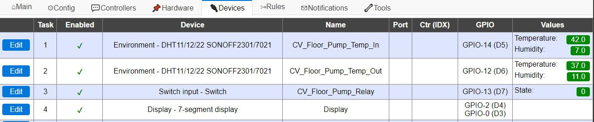
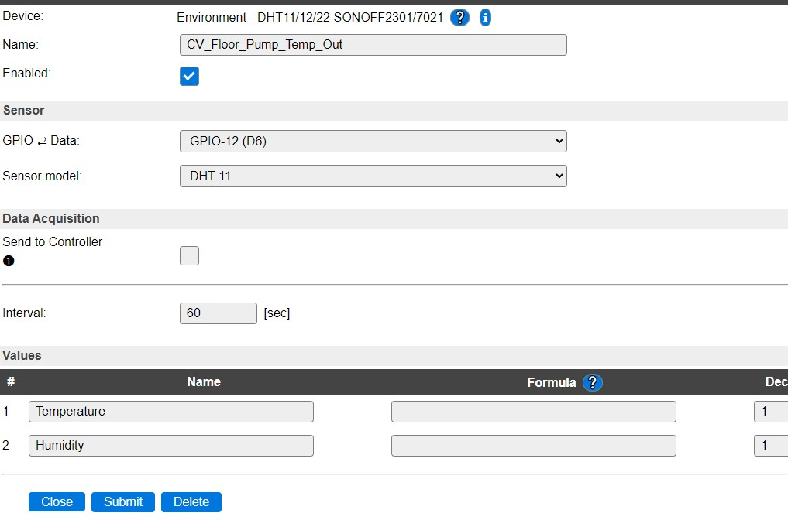

# CV_Floor_Pump
Control the CV floor pump based on the CV inlet temperature

## Description and operation instructions
The CV floorpump will automatically turn on and off during a predefined timewindow by measuring the inlet temperature. The outlet temperature is measured, but there is no action connected to the outlet temperature. The CV floor pump will be turned on above a defined inlet temperature and turned off below a defined temperature. A green led is on at the moment that the pump is on. When the temperature is above a defined temperature, the pump is turned off to make sure there is no damage to the floor when the temperature would be too high. Additional there will be a trigger towards Home Assistant where NodeRed receives the signal and sends an email to Wilko and flips a virtual switch named ‘Floor temp to high’. The functionality in Home Assistant is just for visualisation and emailing. The pump operates independently of Home assistant. The virtual switch needs to be reset via the  button ‘Reset floor temp to high’ on the dashboard otherwise no new alers or emails will be send. The values are hard coded into the code of the ESP CV pump module (NodeMCU). The 8LEDs at the module show the temperature. The 2 most left 8LEDs are the inlet and the 2 most right 8LEDs are the outlet temperature. At a defined time at the end of the day the pump will regularly run to ensure that it will not get stuck when it is not running for a long period. The code to run the pump regularly is hardcoded in the module.

 ## Technical description
The ESP CV pomp module is the hart to turn the CV floor pump on and off. The temperatures of the in and outlet readings including the 'too high' will be send from the ESP to MQTT where NodeRed receives its information. In Home Assistant a virtual helper 'input_boolean.cv_floor_pump_relay' is used to indicate the state of the pump. It receives its information via NodeRed which reads MQTT and updates the value. The Module can operate without MQTT or Home Assistant.

### Parts 
1 x NodeMCU


2 x DHT11


1 x TM1637


1 x BC547B


1 x Relay


1 x Capacitor 1uF
1 x Green Led
1 x 1k Resistor
2 x 30k Resistor
2 x 3 PCB screw connector


### Schematic overview

 
Connect NodeMCU with:
•	Temp sensor 01 to read the temperature at the incoming pipe.
•	Temp sensor 02 to read the temperature at the outgoing pipe. Is not used in any logic. For measurement only.
•	A relay to turn the pump on.
•	A led that can be placed at the outside of the box to indicate that the pump is on.
•	Use a LED display TM1637 to indicate the current in and out temperature. 2 most left are CV in. The two most right figures are CV out.

### ESPEasy installation
See the instructions in 'Arduino projects and programming' (not listed here)


### ESPEasy Configuration








### Interface 
#### Home Assistant
Home Assistant is connected via the MQTT broker.
##### Adjust the configuratio.yaml in HA
• In Home Assistant click in the left menu 'File editor'
• Click at the left top the folder and select 'configuration.yaml'
• Add the following text to be able to read the content of MQTT:
```mqtt:
  broker: 127.0.0.1
  port: 1883                      
  username: '<USERNAME>'
  password: '<PASSWORD>'
```
Add the following text to add the two sensors to HA:
```
# EspEasy sensors running on NodeMCU in the meterkast
sensor:
  - platform: mqtt
    state_topic: 'ESP05_CV_Floor_Pump/status/CV_Floor_Pump_Temp_In'
    name: "CV_Floor_Pump_Temp_In"
    icon: mdi:coolant-temperature
    unit_of_measurement: "°C"
  - platform: mqtt
    state_topic: 'ESP05_CV_Floor_Pump/status/CV_Floor_Pump_Temp_Out'
    name: "CV_Floor_Pump_Temp_Out"
    icon: mdi:coolant-temperature
    unit_of_measurement: "°C"
```
• The icon comes from Home Assistant supported entity icons
 Restart HA to make the sensors visible as entities in HA

##### Add identities to HA 
• In Home Assistant click in the left menu 'Configuration'
• Click 'Helpers'
• Click '+' and select 'Toggle'
• Add 'CV_Pump_Relay'
• Repeat the steps for the 'CV_Floor_TemperatureTooHigh'

##### Create NodeRed flow
• Create the flow: Read the input of MQTT and forward the state to the Helpers that were created in the previous step. 

##### Dashboard
• Create the dashboard and add the temperature sensors and the helpers


### Testing
Test command to turn the relay on: `http://192.168.201.64/control?cmd=gpio,13,1` 13 = D7

### Information
- [DHT11 and DHT22](https://espeasy.readthedocs.io/en/latest/Plugin/P005.html)
- [Switch Input - Switch](https://espeasy.readthedocs.io/en/latest/Plugin/P001.html)
- [Display - 7-segment display](https://espeasy.readthedocs.io/en/latest/Plugin/P073.html)
- [Rules syntax](https://espeasy.readthedocs.io/en/latest/Rules/Rules.html)

Generic
- [Markdown Cheat Sheet](https://www.markdownguide.org/cheat-sheet/)


### Problems
..

### Wishlist
..


### Code
#### Rules Set 1 without annotation
All annotation is stored in the next paragraph to let the #chars be below 2048. It will otherwise not fit in the ESP.
```
on System#Boot do
    gpio,13,0
    
    Let,1,[CV_Floor_Pump_Temp_In#Temperature]*100+[CV_Floor_Pump_Temp_Out#Temperature] 
     
    7don 
    7db,1
    7dn,[var#1]
    
    timerSet,1,60
endon

on Rules#Timer=1 do
    If %systime% > 06:00:00
        If %systime% < 20:00:00
            Publish,ESP05_CV_Floor_Pump/status/insideOfOperationalHours,on
            Let,1,[CV_Floor_Pump_Temp_In#Temperature]*100+[CV_Floor_Pump_Temp_Out#Temperature]
            if [CV_Floor_Pump_Temp_In#Temperature] > 45
                gpio,13,0
                Publish,ESP05_CV_Floor_Pump/status/TemperatureTooHigh,on
            endif          
            if [CV_Floor_Pump_Temp_In#Temperature] > 30
                gpio,13,1
            endif
            if [CV_Floor_Pump_Temp_In#Temperature] < 22
            gpio,13,0
            Publish,ESP05_CV_Floor_Pump/status/TemperatureTooHigh,off
            endif
        endif
        Publish,ESP05_CV_Floor_Pump/status/insideOfOperationalHours,off
    endif

    7dn,[var#1]
 
    Publish,ESP05_CV_Floor_Pump/status/CV_Floor_Pump_Temp_In,[CV_Floor_Pump_Temp_In#Temperature]
    Publish,ESP05_CV_Floor_Pump/status/CV_Floor_Pump_Temp_Out,[CV_Floor_Pump_Temp_Out#Temperature]
    Publish,ESP05_CV_Floor_Pump/status/CV_Floor_Pump_Relay,[CV_Floor_Pump_Relay#State]

    timerSet,1,60
endon

on Clock#Time=All,20:05 do 
    if [CV_Floor_Pump_Temp_In#Temperature] < 35
        gpio,13,1
        Publish,ESP05_CV_Floor_Pump/status/CV_Floor_Pump_Relay,[CV_Floor_Pump_Relay#State]
    endif
endon

on Clock#Time=All,20:15 do
    gpio,13,0
    Publish,ESP05_CV_Floor_Pump/status/CV_Floor_Pump_Relay,[CV_Floor_Pump_Relay#State]
endon

on Clock#Time=All,21:20 do
    gpio,13,0
    Publish,ESP05_CV_Floor_Pump/status/CV_Floor_Pump_Relay,[CV_Floor_Pump_Relay#State]
endon
```
#### Rules Set 1 including annotation
All annotation is stored in this paragraph and is an exact copy of the previous paragraph with the addition of the annotation
```
on System#Boot do
    gpio,13,0 //set pin 13 low. This is the relay of the CV pump
    
//store the value in variable1 to be able to be used later. 
    Let,1,[CV_Floor_Pump_Temp_In#Temperature]*100+[CV_Floor_Pump_Temp_Out#Temperature] 
     
    7don //turn the TM1637 on
    7db,1 //Display the number
    7dn,[var#1] //Display the variable
    
    timerSet,1,60  //set timer 1 with a cycle of 60s
endon // close this part that started with ‘on System#Boot do ‘

on Rules#Timer=1 do // when timer 1 reaches the end of the cycle do
    If %systime% > 06:00:00        //after time …
        If %systime% < 20:00:00    //before time …
            Publish,ESP05_CV_Floor_Pump/status/insideOfOperationalHours,on    //push to MQTT
            Let,1,[CV_Floor_Pump_Temp_In#Temperature]*100+[CV_Floor_Pump_Temp_Out#Temperature] //store the value in variable1 to be able to be used later. 
            if [CV_Floor_Pump_Temp_In#Temperature] > 45 //this is the temperature too high
                gpio,13,0 //turn the relais off
                Publish,ESP05_CV_Floor_Pump/status/TemperatureTooHigh,on
            endif          
            if [CV_Floor_Pump_Temp_In#Temperature] > 30   //when above .. then on
                gpio,13,1
            endif
            if [CV_Floor_Pump_Temp_In#Temperature] < 22   //when below .. then off
            gpio,13,0
            Publish,ESP05_CV_Floor_Pump/status/TemperatureTooHigh,off   // publis to MQTT
            endif
        endif
        Publish,ESP05_CV_Floor_Pump/status/insideOfOperationalHours,off
    endif

    7dn,[var#1]
 
    Publish,ESP05_CV_Floor_Pump/status/CV_Floor_Pump_Temp_In,[CV_Floor_Pump_Temp_In#Temperature]
    Publish,ESP05_CV_Floor_Pump/status/CV_Floor_Pump_Temp_Out,[CV_Floor_Pump_Temp_Out#Temperature]
    Publish,ESP05_CV_Floor_Pump/status/CV_Floor_Pump_Relay,[CV_Floor_Pump_Relay#State]

    timerSet,1,60
endon

on Clock#Time=All,20:05 do //will run once a day at 20:05 to make sure that the pump will not get stuck
    //this timeslot needs to be outside of the timeslot of the automatic switching based on temperature
    if [CV_Floor_Pump_Temp_In#Temperature] < 35   //when below .. then on. Only run when not too hot
        gpio,13,1
        Publish,ESP05_CV_Floor_Pump/status/CV_Floor_Pump_Relay,[CV_Floor_Pump_Relay#State]
    endif
endon


//Make sure that there is an off at a defined time outside the automatic switching window to make sure that the pump is off
on Clock#Time=All,20:15 do //will run once a day at 20:15
    gpio,13,0
    Publish,ESP05_CV_Floor_Pump/status/CV_Floor_Pump_Relay,[CV_Floor_Pump_Relay#State]
endon

on Clock#Time=All,20:20 do //will run once a day at 20:20 as backup if the previous command did not get set
    gpio,13,0
    Publish,ESP05_CV_Floor_Pump/status/CV_Floor_Pump_Relay,[CV_Floor_Pump_Relay#State]
endon
```
