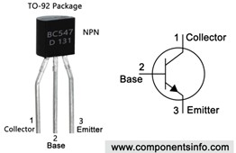

# CV-FloorPump
Control the CV floor pump based on the CV inlet temperature

## Description and operation instructions
De vloerverwarmingspomp gaat automatisch aan en uit door de temperatuur van de CV invoerleiding te meten. De uitvoer temperatuur wordt gemeten, maar wordt niets mee gedaan. Boven een bepaalde temperatuur gaat de pomp aan en onder een bepaalde temperatuur gaat deze uit. Als de pomp draait dan is de groene led aan. Wanneer de temperatuur te hoog wordt dan wordt de pomp uitgeschakeld. Deze temperaturen zijn geprogrammeerd in de code. De 8LEDs op de ESP CV pomp module geven de temperatuur aan waarbij de 2 linker 8LEDs de invoer en de 2 rechter 8LEDs de uitvoer temperatuur weergeven. 
Op het moment dat de temperatuur boven de maximale temperatuur uitkomt, dan wordt de pomp uitgeschakeld en in Home Assistant wordt er een virtuele schakelaar genaamd ‘Floor temp to high’ aan gezet. Wilko krijgt hier een mail van. Deze virtuele schakelaar dient met de schakelaar ‘Reset floor temp to high’ weer uitgezet te worden. Eerder zal de vloerverwarmingspomp niet draaien. 

## Technical description
De ESP CV pomp module is het hart voor het aan en afschakelen van de vloerverwarmingspomp. De temperatuur en dat de invoertemperatuur te heet was worden middels MQTT tussen de ESP CV pomp en Home Assistant uitgewisseld. Zonder MQTT of Home Assistant kan de ESP CV pomp zijn werk doen. The only thing that Home Assistant is needed for is the regularly running of the pump to ensure that it will not get stuck when it is not running for a long period. The code to run the pump regularly is stored in NodeRed

### Parts
1 x NodeMCU


2 x DHT11


1 x TM1637


1 x BC547B


1 x Relay


1 x Capacitor 1uF
1 x Green Led
1 x 1k Resistor
2 x 30k Resistor
2 x 3 PCB screw connector


### Schematic overview

 
Connect NodeMCU with:
•	Temp sensor 01 to read the temperature at the incoming pipe.
•	Temp sensor 02 to read the temperature at the outgoing pipe. Is not used in any logic. For measurement only.
•	A relay to turn the pump on.
•	A led that can be placed at the outside of the box to indicate that the pump is on.
•	Use a LED display TM1637 to indicate the current in and out temperature. 2 most left are CV in. The two most right figures are CV out.

### Configuration ESPEasy


### Interface
#### Home Assistant
Home Assistant is connected via the MQTT broker.

### Testing
Test command to turn the relay on: `http://192.168.201.64/control?cmd=gpio,13,1` 13 = D7

### Information
- [DHT11 and DHT22](https://espeasy.readthedocs.io/en/latest/Plugin/P005.html)
- [Switch Input - Switch](https://espeasy.readthedocs.io/en/latest/Plugin/P001.html)
- [Display - 7-segment display](https://espeasy.readthedocs.io/en/latest/Plugin/P073.html)
- [Rules syntax](https://espeasy.readthedocs.io/en/latest/Rules/Rules.html)

Generic
- [Markdown Cheat Sheet](https://www.markdownguide.org/cheat-sheet/)


### Problems
..

### Wishlist
Let the temp become visible in HA


### Code
#### Rules Set 1 without annotation
//All annotation is stored in the next paragraph to let the #chars be below 2048. It will otherwise not fit in the ESP.
```
on System#Boot do
    gpio,13,0
    
    Let,1,[CV_Floor_Temp_In#Temperature]*100+[CV_Floor_Temp_Out#Temperature] 

     
    7don
    7db,1
    7dn,[var#1]
    
    timerSet,1,60
endon

on Rules#Timer=1 do
    If %systime% > 06:00:00
        If %systime% < 20:00:00
            Publish,ESP05_CV_Floor/status/insideOfOperationalHours,on
            Let,1,[CV_Floor_Temp_In#Temperature]*100+[CV_Floor_Temp_Out#Temperature]
            if [CV_Floor_Temp_In#Temperature] > 45
                gpio,13,0 //turn the relais off
                Publish,ESP05_CV_Floor/status/TemperatureTooHigh,on
            endif
            
            if [CV_Floor_Temp_In#Temperature] > 30
                gpio,13,1
            endif
            
            if [CV_Floor_Temp_In#Temperature] < 22
            gpio,13,0
            Publish,ESP05_CV_Floor/status/TemperatureTooHigh,off
            endif
        else
            gpio,13,0
            Publish,ESP05_CV_Floor/status/insideOfOperationalHours,off
        endif
    else
        gpio,13,0
        Publish,ESP05_CV_Floor/status/insideOfOperationalHours,off
  endif
    7dn,[var#1]
    
    Publish,ESP05_CV_Floor/status/CV_Floor_Temp_In,[CV_Floor_Temp_In#Temperature]
    Publish,ESP05_CV_Floor/status/CV_Floor_Temp_Out,[CV_Floor_Temp_Out#Temperature]
    Publish,ESP05_CV_Floor/status/CV_Pump_Relay,[CV_Pump_Relay#State]

    timerSet,1,60
endon
```
#### Rules Set 1 including annotation
//All annotation is stored in this paragraph and is an exact copy of the previous paragraph with the addition of the annotation
```
//The annotation is stored here to let the #chars be below 2048! Make sure to update the above and below codes to keep them consistent

on System#Boot do
    gpio,13,0 //set pin 13 low. This is the relay of the CV pump
    
//store the value in variable1 to be able to be used later. 
    Let,1,[CV_Floor_Temp_In#Temperature]*100+[CV_Floor_Temp_Out#Temperature] 

     
    7don //turn the TM1637 on
    7db,1 //Display the number
    7dn,[var#1] //Display the variable
    
    timerSet,1,60  //set timer 1 with a cycle of 60s
endon // close this part that started with ‘on System#Boot do ‘

on Rules#Timer=1 do // when timer 1 reaches the end of the cycle do
    If %systime% > 06:00:00        //before time …
        If %systime% < 20:00:00    //after time …
            Publish,ESP05_CV_Floor/status/insideOfOperationalHours,on    //push to MQTT
            Let,1,[CV_Floor_Temp_In#Temperature]*100+[CV_Floor_Temp_Out#Temperature] //store the value in variable1 to be able to be used later. 

            if [CV_Floor_Temp_In#Temperature] > 45 //this is the temperature to high
                gpio,13,0 //turn the relais off
                Publish,ESP05_CV_Floor/status/TemperatureTooHigh,on
            endif
            
            if [CV_Floor_Temp_In#Temperature] > 30   //when above .. then on
                gpio,13,1
            endif
            
            if [CV_Floor_Temp_In#Temperature] < 22   //when below .. then off
            gpio,13,0
            Publish,ESP05_CV_Floor/status/TemperatureTooHigh,off   // publis to MQTT
            endif
        else
            gpio,13,0
            Publish,ESP05_CV_Floor/status/insideOfOperationalHours,off
        endif
    else
        gpio,13,0
        Publish,ESP05_CV_Floor/status/insideOfOperationalHours,off
  endif
    7dn,[var#1]
    
    Publish,ESP05_CV_Floor/status/CV_Floor_Temp_In,[CV_Floor_Temp_In#Temperature]
    Publish,ESP05_CV_Floor/status/CV_Floor_Temp_Out,[CV_Floor_Temp_Out#Temperature]
    Publish,ESP05_CV_Floor/status/CV_Pump_Relay,[CV_Pump_Relay#State]

    timerSet,1,60
endon

```
